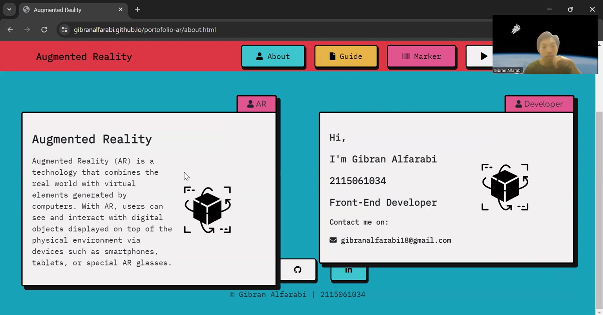

# Augmented Reality (AR) 

An augmented reality (AR) web application is a technology that allows users to view and interact with digital objects overlaid on the physical environment through devices such as smartphones, tablets, or special AR glasses. AR technology combines the real world with virtual elements generated by computers, providing an immersive and interactive experience.

## Link

This is the link to go to the application:
https://gibranalfarabi.github.io/portofolio-ar/index.html

## Scan QR Code

Or you can use this QR Code to go to the application:

## Video

Here’s a demonstration video:

  

## Documentation

